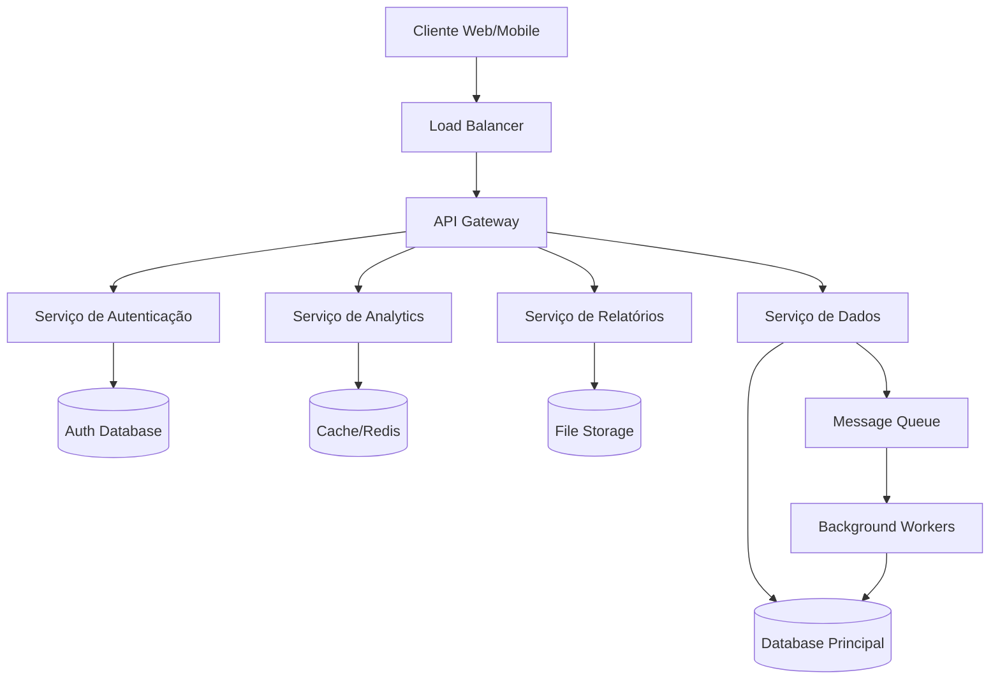

# Arquitetura do Sistema

## 🏗️ Visão Geral da Arquitetura

O UBC Lab BD segue uma arquitetura modular e escalável, baseada em microsserviços e princípios de design modernos.

## 📊 Diagrama de Arquitetura



## 🔧 Componentes Principais

### Frontend
- **Tecnologia**: React/Vue.js
- **Responsabilidades**:
  - Interface do usuário
  - Visualização de dados
  - Interação com APIs

### API Gateway
- **Tecnologia**: Kong/NGINX
- **Responsabilidades**:
  - Roteamento de requisições
  - Autenticação e autorização
  - Rate limiting
  - Logging centralizado

### Microsserviços

#### Serviço de Autenticação
```python
# Estrutura básica
auth/
├── models/
│   ├── user.py
│   └── role.py
├── services/
│   ├── auth_service.py
│   └── jwt_service.py
├── controllers/
│   └── auth_controller.py
└── middleware/
    └── auth_middleware.py
```

#### Serviço de Dados
```python
# Estrutura básica
data/
├── models/
│   ├── dataset.py
│   └── schema.py
├── services/
│   ├── data_service.py
│   └── validation_service.py
├── repositories/
│   └── data_repository.py
└── processors/
    └── data_processor.py
```

#### Serviço de Analytics
```python
# Estrutura básica
analytics/
├── algorithms/
│   ├── statistical.py
│   └── ml_models.py
├── services/
│   └── analytics_service.py
└── utils/
    └── data_transformer.py
```

## 🗄️ Camada de Dados

### Banco de Dados Principal
- **Tecnologia**: PostgreSQL
- **Uso**: Dados transacionais, metadados
- **Características**:
  - ACID compliance
  - Relações complexas
  - Consultas SQL avançadas

### Cache Layer
- **Tecnologia**: Redis
- **Uso**: Cache de consultas frequentes
- **Características**:
  - Alta performance
  - TTL configurável
  - Distribuído

### File Storage
- **Tecnologia**: MinIO/S3
- **Uso**: Arquivos grandes, backups
- **Características**:
  - Escalabilidade horizontal
  - Versionamento
  - CDN integration

## 🔄 Fluxo de Dados

### 1. Ingestão de Dados
```
Fonte de Dados → Validação → Transformação → Armazenamento
```

### 2. Processamento
```
Dados Brutos → Algoritmos → Resultados → Cache → API
```

### 3. Consulta
```
Cliente → Gateway → Serviço → Cache/DB → Resposta
```

## 🔒 Segurança

### Autenticação
- JWT tokens com refresh
- OAuth 2.0 para integração externa
- Multi-factor authentication (MFA)

### Autorização
- Role-based access control (RBAC)
- Resource-level permissions
- API rate limiting

### Criptografia
- Dados em trânsito: TLS 1.3
- Dados em repouso: AES-256
- Chaves gerenciadas via HSM/KMS

## 📈 Escalabilidade

### Horizontal Scaling
- Microsserviços independentes
- Load balancing automático
- Auto-scaling baseado em métricas

### Vertical Scaling
- Otimização de queries
- Indexação inteligente
- Connection pooling

### Caching Strategy
```
L1: In-memory cache (aplicação)
L2: Redis cluster
L3: CDN (conteúdo estático)
```

## 🔧 DevOps e Infraestrutura

### Containerização
```dockerfile
# Exemplo de Dockerfile
FROM python:3.11-slim

WORKDIR /app
COPY requirements.txt .
RUN pip install -r requirements.txt

COPY . .
EXPOSE 8000

CMD ["gunicorn", "app:app"]
```

### Orquestração
- **Kubernetes** para produção
- **Docker Compose** para desenvolvimento

### CI/CD Pipeline
```yaml
# .github/workflows/deploy.yml
stages:
  - test
  - build
  - security-scan
  - deploy-staging
  - integration-tests
  - deploy-production
```

## 📊 Monitoramento

### Métricas
- Application Performance Monitoring (APM)
- Business metrics
- Infrastructure metrics

### Logging
- Structured logging (JSON)
- Centralized log aggregation
- Log retention policies

### Alerting
- Proactive alerts
- SLA monitoring
- Escalation procedures

## 🌐 APIs e Integrações

### REST API Design
```
GET    /api/v1/datasets          # Listar datasets
POST   /api/v1/datasets          # Criar dataset
GET    /api/v1/datasets/{id}     # Obter dataset
PUT    /api/v1/datasets/{id}     # Atualizar dataset
DELETE /api/v1/datasets/{id}     # Deletar dataset
```

### GraphQL (Futuro)
- Query complexa em uma requisição
- Schema type-safe
- Real-time subscriptions

### Webhooks
- Notificações de eventos
- Retry mechanisms
- Signature validation

## 🚀 Performance

### Database Optimization
- Query optimization
- Index strategies
- Partitioning
- Read replicas

### Caching
- Query result caching
- Object caching
- Page caching

### CDN
- Static asset delivery
- Global distribution
- Cache invalidation

## 📋 Patterns e Princípios

### Design Patterns
- **Repository Pattern**: Abstração de dados
- **Factory Pattern**: Criação de objetos
- **Observer Pattern**: Eventos e notificações
- **Strategy Pattern**: Algoritmos intercambiáveis

### SOLID Principles
- Single Responsibility
- Open/Closed
- Liskov Substitution
- Interface Segregation
- Dependency Inversion

### 12-Factor App
- Configuração via environment
- Stateless processes
- Explicit dependencies

---

*Para implementar esta arquitetura, consulte o [Guia de Configuração do Ambiente](../desenvolvimento/configuracao-ambiente.md).*